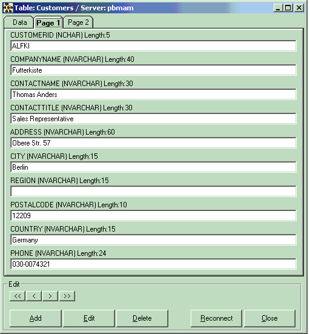



## Dynamic Data

### Description

With DYNDATA your are able to connect to a SQL-Server Database and edit the data in thier tables. DYNDATA builds dynamically the needed textfields and checkboxes.

It uses ADO without databindingcontrols. You can select a database and table from a combobox and then connect to your given SQL-Server.

All information about login, tables and databases

are extracted from information_schema views and system tables.

It is a tool I need for editing quickly data in tables without having additional tools.

Thanks for voting
 
### More Info
 

             |
---                |---
**Submitted On**   |2002-08-22 16:02:06
**By**             |[Marek Adar](https://github.com/Planet-Source-Code/PSCIndex/blob/master/ByAuthor/marek-adar.md)
**Level**          |Intermediate
**User Rating**    |4.3 (30 globes from 7 users)
**Compatibility**  |VB 5\.0, VB 6\.0
**Category**       |[Databases/ Data Access/ DAO/ ADO](https://github.com/Planet-Source-Code/PSCIndex/blob/master/ByCategory/databases-data-access-dao-ado__1-6.md)
**World**          |[Visual Basic](https://github.com/Planet-Source-Code/PSCIndex/blob/master/ByWorld/visual-basic.md)
**Archive File**   |[Dynamic\_Da1210618222002\.zip](https://github.com/Planet-Source-Code/marek-adar-dynamic-data__1-38177/archive/master.zip)

